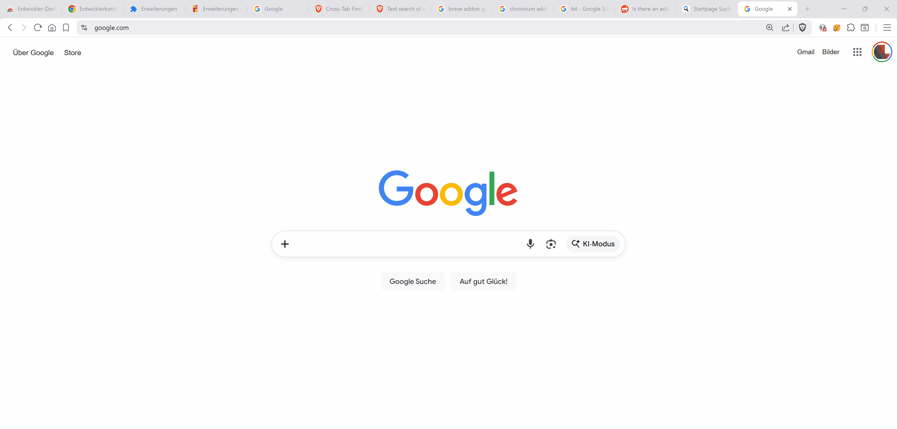

# Tab Sorter Cleaner

Chromium extension that helps you sort and group tabs, close duplicates, and
review tab activity from a dedicated action window.

GitHub Pages: https://shurkantwo.github.io/chromium-tab-sorter-cleaner/
Tested working in Brave browser as well: [brave.com](https://brave.com)

## Features

- Dedicated action window with status/progress output.
- Targets the window it was opened from (click to focus the target window).
- Sort tabs A-Z by title or by last visited order.
- Close duplicate tabs quickly.
- Group tabs by domain or by topic (using page text when available).
- Collapse/expand all tab groups and ungroup everything.
- Undo the last action.
- Optionally activate tabs during scans to capture page text reliably.
- Pinned tabs are excluded from actions and grouping.

## Permissions

- `tabs`: read and manage tabs for sorting and deduplication.
- `history`: inspect recent activity to support cleanup decisions.
- `storage`: persist settings.
- `tabGroups`: organize tabs into groups.
- `scripting`: read visible page text for topic grouping.
- Host access: optional, requested at runtime for page text scanning.

## Install (unpacked)

1. Open `chrome://extensions`.
2. Enable Developer mode.
3. Click "Load unpacked" and select this folder.

For faster reloads during development (especially in Brave):

1. Run `./scripts/prepare-unpacked.sh`.
2. In `brave://extensions`, load unpacked from `dist/` instead of the repo root.

This avoids scanning large dev folders like `node_modules` on every reload.

Optional live sync while editing:

1. Run `./scripts/watch-unpacked.sh`.
2. Keep Brave loaded from `dist/` and use Reload after edits.

## Usage

Click the toolbar button to open the action window and run actions.
The window targets the browser window it was opened from; click the target
label to focus it.

## Troubleshooting (Brave content grouping)

- Set Site access to "On all sites" in `brave://extensions` while testing.
- Restricted pages (e.g., `chrome://`, Chrome Web Store) cannot be scanned.
- Discarded or not-fully-loaded tabs are skipped for content scans.
- File URLs require "Allow access to file URLs" in extension details.
- If content scans still time out, enable "Activate tabs for content scan".
- Pinned tabs are excluded from actions and grouping.

## Disclaimer

This extension is provided "as is" without warranty of any kind. You use it at
your own risk. The authors are not liable for any damages or losses arising
from its use.

## Author

Lucas Lepski

## License

Source-available, not open source. Personal non-commercial use of the
unmodified software is allowed; copying, modification, redistribution, and
commercial use require prior written permission. See [LICENSE](LICENSE).
